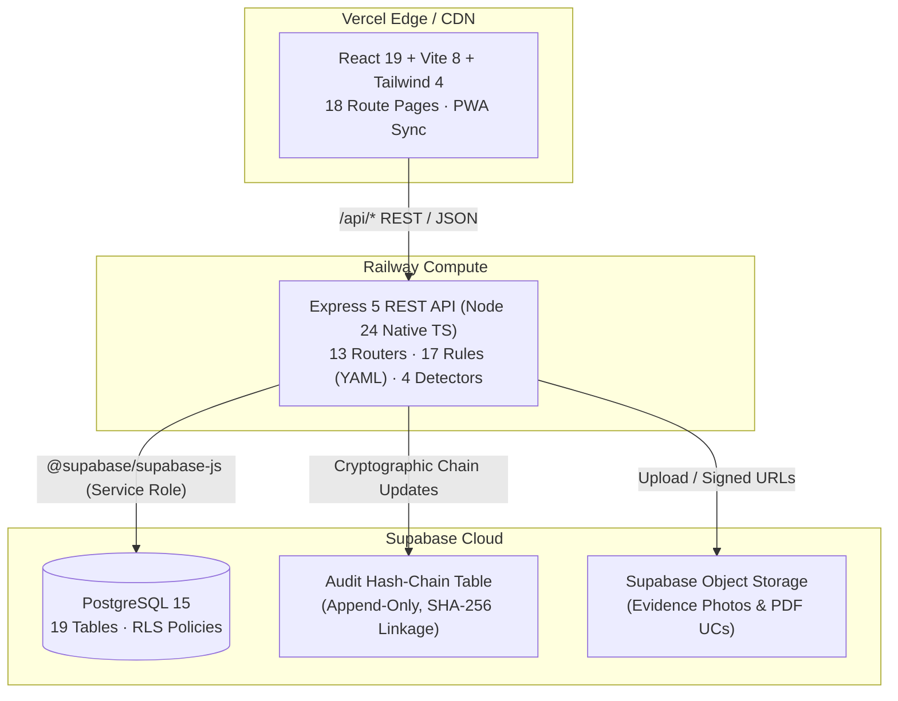

# MPLADS Platform — Architectural Doctrine & System Design

---

## The 6 Architectural Doctrines

1. **Deterministic PRNG & No Math.random()**: All synthetic seeding, anomaly injections, and simulation fixtures use seeded Mulberry32 PRNGs. Any test run or demo execution is 100% bit-for-bit reproducible.
2. **Tamper-Evident Hash Chain**: Every state mutation (ingest, review action, alert status change, inspection upload) computes:
   $$\text{payload\_hash} = \text{sha256}(\text{canonicalJson}(\text{payload}))$$
   $$\text{this\_hash} = \text{sha256}(\text{seq} \mid \text{prev\_hash} \mid \text{payload\_hash})$$
   Retroactive modifications break the mathematical chain instantly and trigger real-time alerts.
3. **Alert Budgeting & Attention Economy**: Officers cannot be overwhelmed by hundreds of trivial alerts. Each district is allotted a strict budget of max 10 open alerts in the primary triage queue; overflow is routed to Backlog.
4. **Public Whitelist Isolation**: Public citizen endpoints map properties explicitly one-by-one from a strictly defined whitelist. Raw internal objects are never spread, and internal risk scores never leak.
5. **Self-Pruning Rule Probation**: Any rule dropping below 40% actionable rate across 25 casework reviews is automatically suspended from active evaluation to protect officer attention.
6. **The Null-Field Rule**: Missing data is classified as an ingest data-quality finding, never as evidence of contractor fraud. Rules evaluate to false on null fields.
